<p align="center">
  
  
  
</p>
<br>

# Jellyfish Theme | 


This theme is heavily inspired by [Flow](https://github.com/LitCastVlog/Flow), [Zesty](https://github.com/stpnwf/ZestyTheme) and [Ultrachromic](https://github.com/CTalvio/Ultrachromic)
I've made a few tweaks and modifications of my own.

Login page backgrounds from [@ksushlapush](https://unsplash.com/@ksushlapush)


----
\
**Main Theme with JellyBlue as default**

``` css
@import url("https://cdn.jsdelivr.net/gh/n00bcodr/Jellyfish/theme.css");
```

<table align="center">
  <tr>
    <th style="text-align:center">Home</th>
    <th style="text-align:center">Item Details</th>
  </tr>
  <tr>
    <td></td>
    <td>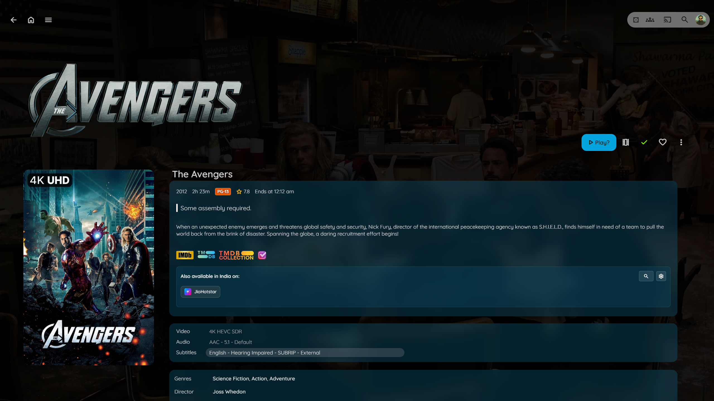</td>
  </tr>
  <tr>
    <th style="text-align:center">Login I</th>
    <th style="text-align:center">Login II</th>
  </tr>
  <tr>
    <td>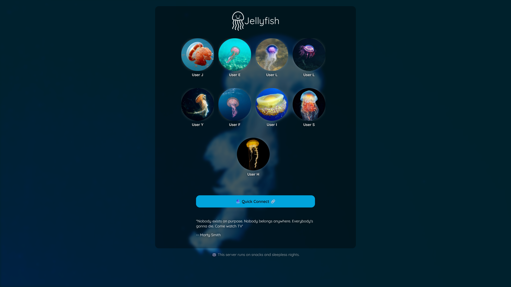</td>
    <td>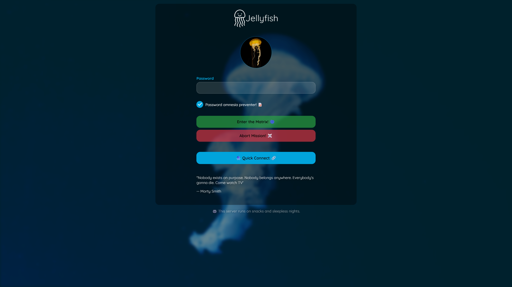</td>
  </tr>
</table>


<p align="center">
----
</p>

**Floating Progress Bar**

``` css
@import url("https://cdn.jsdelivr.net/gh/n00bcodr/Jellyfish/progress_bar.css");
```
<table align="center">
  <tr>
    <th style="text-align:center">Without</th>
    <th style="text-align:center">With</th>
  </tr>
  <tr>
    <td></td>
    <td></td>
  </tr>
</table>


<p align="center">
----
</p>

**Indicators attached in the corner**
``` css
@import url("https://cdn.jsdelivr.net/gh/n00bcodr/Jellyfish/indicators.css");
```
<table align="center">
  <tr>
    <th style="text-align:center">Without</th>
    <th style="text-align:center">With</th>
  </tr>
  <tr>
    <td></td>
    <td></td>
  </tr>
</table>


<p align="center">
----
</p>

**Text Instead of Icons**
\
\
In item details page, show text for Play, Trailer, Mark as watched etc.

``` css
@import url("https://cdn.jsdelivr.net/gh/n00bcodr/Jellyfish/icontext.css");
```
<table align="center">
  <tr>
    <th style="text-align:center">Without</th>
    <th style="text-align:center">With</th>
  </tr>
  <tr>
    <td></td>
    <td></td>
  </tr>
</table>


<p align="center">
----
</p>

**Coloured Parental Ratings**


> [!NOTE]
> Only works with a custom [javascript](scripts/rating.js)

``` css
@import url("https://cdn.jsdelivr.net/gh/n00bcodr/Jellyfish/ratings.css");
```

<p align="center">
----
</p>

<p align="center">
----
</p>

<h3> Logo</h3>

Streamberry Logo (inspired by Black Mirror) instead of Jellyfish Logo. Included by default with [jellyflix.css](colors\jellyflix.css)

``` css
@import url("https://cdn.jsdelivr.net/gh/n00bcodr/Jellyfish/streamberry_logo.css");
```

---
## Colors:

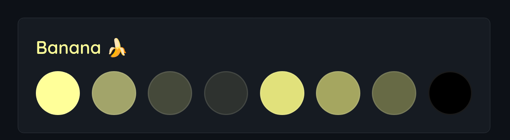

``` css
@import url("https://cdn.jsdelivr.net/gh/n00bcodr/Jellyfish/colors/banana.css");
```

<p align="center">
----
</p>

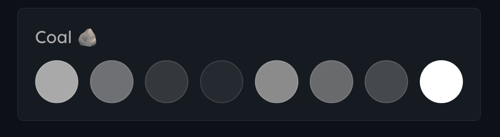

``` css
@import url("https://cdn.jsdelivr.net/gh/n00bcodr/Jellyfish/colors/coal.css");
```
<p align="center">
----
</p>

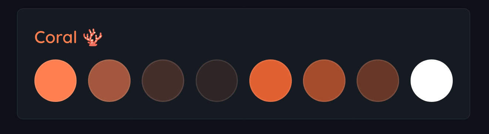

``` css
@import url("https://cdn.jsdelivr.net/gh/n00bcodr/Jellyfish/colors/coral.css");
```
<p align="center">
----
</p>

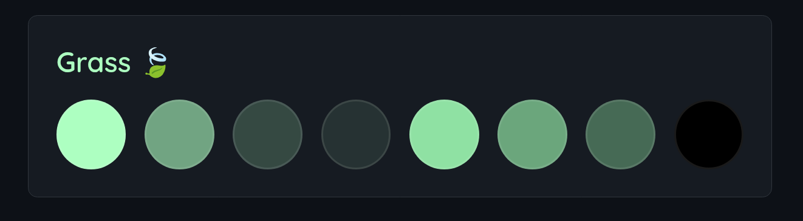

``` css
@import url("https://cdn.jsdelivr.net/gh/n00bcodr/Jellyfish/colors/grass.css");
```
<p align="center">
----
</p>

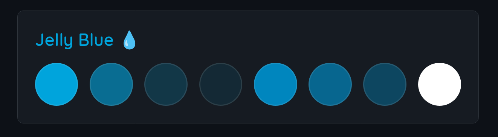

``` css
@import url("https://cdn.jsdelivr.net/gh/n00bcodr/Jellyfish/colors/jellyblue.css");
```
<p align="center">
----
</p>

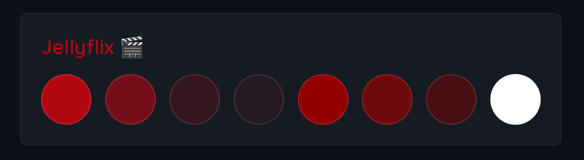

``` css
@import url("https://cdn.jsdelivr.net/gh/n00bcodr/Jellyfish/colors/jellyflix.css");
```
<p align="center">
----
</p>

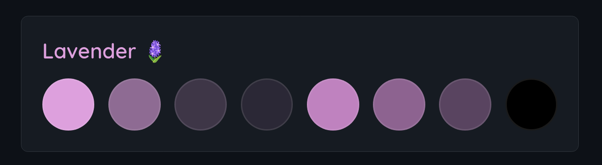

``` css
@import url("https://cdn.jsdelivr.net/gh/n00bcodr/Jellyfish/colors/lavender.css");
```
<p align="center">
----
</p>

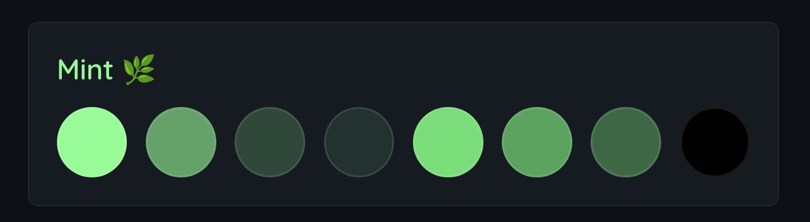

``` css
@import url("https://cdn.jsdelivr.net/gh/n00bcodr/Jellyfish/colors/mint.css");
```
<p align="center">
----
</p>

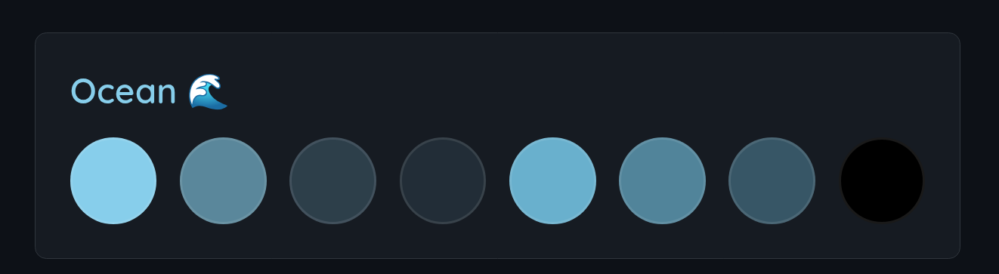

``` css
@import url("https://cdn.jsdelivr.net/gh/n00bcodr/Jellyfish/colors/ocean.css");
```
<p align="center">
----
</p>

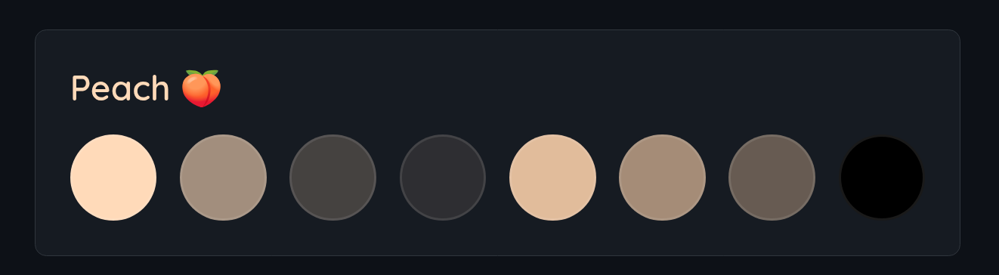

``` css
@import url("https://cdn.jsdelivr.net/gh/n00bcodr/Jellyfish/colors/peach.css");
```
<p align="center">
----
</p>

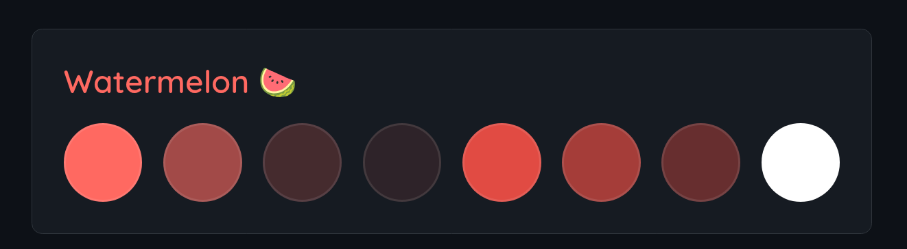

``` css
@import url("https://cdn.jsdelivr.net/gh/n00bcodr/Jellyfish/colors/watermelon.css");
```

## 🧪 Compatibility

- Works for Movies and TV Shows, should work fine mostly for Music and Books, although I don't use Jellyfin for either of them
- Works on both mobile app and web browser, known to have issues / not work on Jellyfin Media Player


