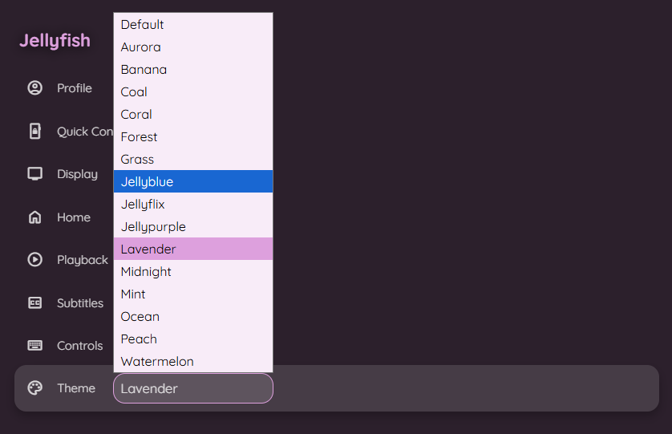

 Scripts 📜
====================

These are various JavaScripts I use along with the theme for Jellyfin. These scripts provide extra functionality that cannot be achieved with CSS alone.

Here's a breakdown of what each script does:

### [title.js](title.js)

-   Changes the browser tab title from "Jellyfin" to "Jellyfish". Theoritically one can use it to change it to anything.

### [loginimage.js](loginimage.js)

-  Displays the user's profile picture on the manual login screen instead of the name. When a user is selected, their avatar appears above the password field. This script can be used without this theme and is tested on a few different themes. \
  Check [login2.png](../screenshots/login2.png)

### [pausescreen.js](pausescreen.js)

- Displays a dynamic pause screen overlay when media is paused. It shows the item's logo, details (year, rating, runtime), and a spinning disc art. This is a modified version of the script by [BobHasNoSoul](https://github.com/BobHasNoSoul/Jellyfin-PauseScreen). This also has all the CSS needed in the script itself, so it doesn't need a separate CSS file.

### [rating.js](rating.js)

- Adds the content rating (e.g., PG, R, TV-MA) as a rating attribute to the rating element in the HTML to help style it as jellyfin does not do it natively. \
  This is a companion script for the ratings.css modification. It allows for applying specific styles to different content ratings, such as adding colors.  \
  Check [ratings.png](../screenshots/ratings.png)

### [theme_selector.js](theme_selector.js)

- Adds a theme selector dropdown menu to the user's profile settings. This is to make it easier for users to switch between the different [color schemes](/colors/) available in the Jellyfish theme without manually adding @imports

<table align="center">
  <tr>
    <th style="text-align:center">Button</th>
    <th style="text-align:center">Options</th>
  </tr>
  <tr>
    <td></td>
    <td></td>
  </tr>
</table>

🚀 Installation
---------------

If you're here, I’ll assume you're familiar with injecting custom JavaScript. 😄 \
If not, you can find installation instructions to inject custom JS in [Jellyfin-Enhanced](https://github.com/n00bcodr/Jellyfin-Enhanced?tab=readme-ov-file#-installation), the process is similar.